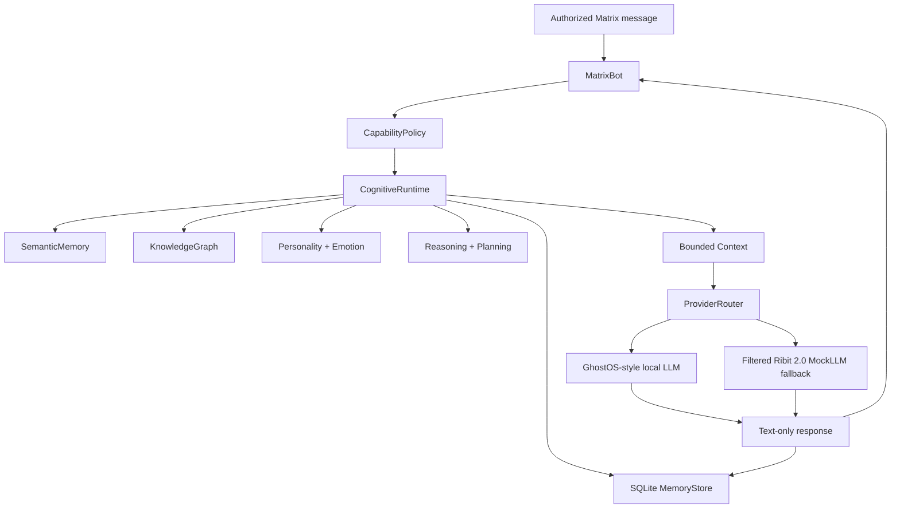

# Ribit Termux 0.2 Harmonized Architecture

The supplied projects contain **629 statically analyzed Python files** after separating the canonical package trees from duplicated archive copies. The Termux 0.2 branch does not flatten those files into one import namespace. Instead, it establishes one maintained runtime with explicit boundaries, canonical implementations, and non-executing adapters.

> **Integration principle:** A module is integrated through a stable role and interface, not by importing every duplicate or high-authority implementation into the Matrix callback. This preserves the useful cognitive structure while keeping the bot practical on Android and safe for a chat transport.

## Runtime flow

## Module-source map

| Architecture role | Canonical implementation in 0.2 | Source patterns incorporated | Runtime boundary |
| --- | --- | --- | --- |
| Policy | `ribit_termux.policy` | GhostOS–Ribit `CapabilityPolicy` and bridge design | All high-impact capabilities deny by default. |
| Persistent memory | `ribit_termux.memory` | Existing Termux SQLite memory; NewTermux conversation and storage concepts | Local SQLite only; no user database is tracked. |
| Semantic retrieval | `ribit_termux.cognition.semantic` | NewTermux `tensor_memory.py`, `embedding_engine.py`, `semantic_search.py`, `mock_model.py` | Deterministic hashed vectors; bounded in-memory cache. |
| Graph knowledge | `ribit_termux.cognition.knowledge` | NewTermux `knowledge_graph.py`, `learning_engine.py`, `graph_reasoner.py` | In-process text relationships; no external lookup. |
| Style state | `ribit_termux.cognition.persona` | NewTermux `personality_engine.py`, `emotion_manager.py` | Metadata only; does not override safety or factual uncertainty. |
| Reasoning and planning | `ribit_termux.cognition.reasoning` | NewTermux `reasoning_engine.py`, `attention_engine.py`, `hypothesis_engine.py`, `reflection_engine.py`, `planning_engine.py` | Produces an explainable text trace and non-executing plans. |
| Context assembly | `ribit_termux.cognition.context` | NewTermux `context_manager.py`; GhostOS–Ribit `bridge.py` | Small structured context, capped before provider use. |
| Model providers | `ribit_termux.providers` | GhostOS–Ribit loopback client; Ribit 2.0 mock fallback | Text generation only; action plans are never dispatched. |
| Matrix transport | `ribit_termux.matrix_bot` | Existing Termux bot and Matrix modules | Authorized messages only; no E2EE claim in 0.2. |

## Integration classification

| Module group | Count and examples | 0.2 treatment |
| --- | --- | --- |
| Safe cognitive and memory components | NewTermux graph, semantic memory, attention, planning, personality, emotion, reflection, context | Consolidated into the cognitive subsystem and covered by tests. |
| Ribit mock-model hierarchy | `MockRibit20LLM`, enhanced/advanced wrappers, response samples | Retains canonical mock fallback behind a text-only filter. Parameter-heavy wrappers remain optional reference material until their output contract is tightened. |
| GhostOS–Ribit add-on | Local knowledge, word learning, policy, JSON-to-Python review artifacts, local LLM adapter | Policy and local-first patterns are directly reflected. Generated code remains review-only and no GhostOS runtime is required. |
| Full GhostOS and MOSS | 457 modules in the supplied GhostOS source tree | External optional ecosystem; not copied into a lightweight Android Matrix process. |
| Duplicate archive copies | Identical `agent_manager`, `ribit_termux_enhanced`, and `robotics_interface` variants | One canonical design or no import; duplicates are never merged. |
| High-authority modules | Controllers, ROS, web search, image generation, dynamic plugins, multilang execution, self-testing execution, autonomous loops, clusters | Registered as excluded capabilities. They cannot become available through a Matrix message. |
| Molequla | Autonomous ecology and trainer modules | Separate research/inference runtime; not coupled to the bot process. |

## Message-scoped computation

The cognitive runtime processes one message at a time. It records user text, updates local semantic and graph indexes, creates a short context package, asks the configured provider for plain text, records the response, then returns diagnostics. It does not start a thread, schedule an autonomous job, invoke a subprocess, browse the web, import a plug-in, or control an Android application.

## Safe user commands

| Command | Result |
| --- | --- |
| `?ask <question>` | Runs bounded cognition and a text provider. |
| `?teach <text>` | Stores user-approved local knowledge and semantic associations. |
| `?memory` | Reports compact persistent-memory facts and word counts. |
| `?mind` | Shows semantic, graph, personality, emotion, and policy diagnostics. |
| `?plan <goal>` | Returns a non-executing textual task plan. |
| `?status` / `?sys` | Reports local provider and runtime state only. |

## Known limitations

The 0.2 branch is not a full GhostOS deployment, a Matrix E2EE implementation, an autonomous agent runner, a robot-control system, or a Molequla trainer. Those systems have materially different runtime, dependency, hardware, and authority requirements. Their code is catalogued for future adapter work rather than silently placed in a mobile message handler.
